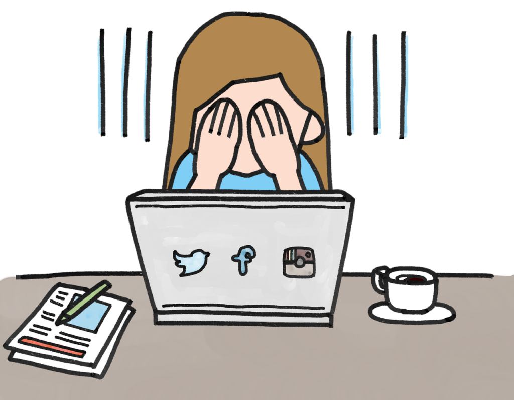

# The Consequences of Social Media
The downsides of using social media and how they could affect users and their experience
## General Drawbacks
Unfortunately, **nearly uninhibited online communication does have its flaws**. While social media was intended to **allow everyone to freely express themselves through various forms of media and celebrate each other without judgement**, **it isn't a perfect system**. With heightened levels of **online vulnerability**, users can find themselves at the mercy of other users.

**General Downsides of Using Social Media Are:**
- Privacy isn't guaranteed
- It can negatively impact your mental, and sometimes physical, health
- It can negatively impact users' self-confidence and damage their perceptions of themselves and others due to peer pressure and societal expectations perpetuated by social media
- Users can be susceptible to various forms of fraud and scams
- Usage can become distracting and addicting (especially for younger generations)
- Cyberbullying (which can lead to in-person bullying too)
- Misinformation can be reached and spread by a widespread audience which can make it hard for it to be fact-checked and corrected
- Hacking can lead to leaked private information and the hacking of other individuals connected to the hacked user
- Reputations can be tarnished and ruined even if the justification for the online attack is inaccurate/untrue

## Combatting the Negative Effects of Social Media
While the consequences of social media can take a toll on users, **there are ways users are fighting back**. Many users who experience psychological effects from social media usage may **seek out therapy or counseling** to improve their **mental health**, **self-image**, or **negative mindsets**. If users are struggling to separate themselves from their social image and alleviate the effects of social media on their conscience, **they may choose to temporarily deactivate their account or permanently delete social media**. We have commonly seen celebrities take breaks from social media following **public scrutiny** or because of **privacy concerns**. While reputations can be tarnished, if they're **effectively defended** or **"redeemed"** in the public eye, **reputations can still  be quickly repaired**. However, it's becoming **more common for younger generations to take breaks from social media** in the name of "bettering themselves" or to "experience life to the fullest".

In regards to bullying, users are able to **block** or **mute other users who harass them**. Additionally, many social media platforms offer ways to **report cyberbullies**. These reports get reviewed and **the perpetrators can be subject to getting banned or restricted**. Social media platforms are becoming increasingly better at **enforcing guideline restrictions** and **provide a larger selection of self-reporting options**f. On some platforms, such as Instagram, there are ways to report posts that attempt to spread misinformation. These posts may be **labelled as misinformation or inaccurate** so users aren't **misled upon seeing them**. Additionally, users who notice that posts may contain false information will occasionally attempt to **correct those mistakes either in their own posts or in the comments of the orginal post**.

These days, social media is a **dazzling online realm where features you may not have ever heard of or imagined exist for anybody to use**. It **sets the trends**, **bestows fame upon users**, **can emotionally move users**, and **rally adcovates together for good causes**. However, it can be quite **draining** and **addicting** for many users as we develop a **reliance on our online interactions**. It's difficult to not compare yourself to others when all you might see is the **"best" versions of what they post about themselves**. It can also be difficult to stop using something so entertaining due to how multipurpose social media is. However, there are features on some devices where users can **set time limits for themselves** on certain apps such as social media apps. This can help users **develop more self control when it comes to their social media usage**.

**Hacking unfortunately can happen to anyone**, regardless of how popular you are. New social media users, especially the older demographic of social media users, **fall victim to fake messages from hackers posing to be other people**. They **entice users by advertising** some sort of **appealing product which incentivizes the user to click a compromising link** which then allows their account to be hacked. **Identity fraud** is a tactic many hackers use to catfish individuals so their own identity isn't revealed. Additionally, people may pose as other people to attempt to defame an indidivudal through cyberbullying or by making the person they're posing as **post uncharacteristic things**. However, if a user is suspicious that somebody is impersonating them or hacking them they are able to **contact social media support** and **reset their password to kick any unwanted guests off of their account**. **Technology has fortunately advanced enough** to where **users have more control over what happens to them and their social media accounts**.
