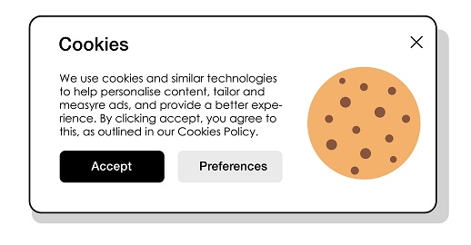

# How to Use Social Media
Understanding how to make an account on social media
## Information needed to make a social media account
Many social media platforms require that you share some personal information with them when creating a personalized account for yourself. **This process typically involves providing your**:
- Name
- Age
- Birthday
- Address
- Email
- Phone Number
- Preferred username for the new account
- Preferred password for the new account
## Permissions
Oftentimes, social media platforms will request access to a user's **location, phone number contacts, and other apps to allow for a more personalized experience**. Users can more easily befriend others who use the app based on their phone number contacts or even invite them to start using the app which helps expand the userbase. Additionally, these platforms will have users agree to cookies to **cater ads to the user's tastes based on their data**.

While most of the aforementioned features **aren't necessary for the main functionality of the app**, they are **helpful** to have **if you plan on utilizing certain features**. Those concerned with security may opt out of these permissions and will **only agree to the required terms and conditions along with the necessary features for the platform**. Social media **CAN** be anonymous if a user desires that level of security to percieve and post content they enjoy.

  

## Getting Started
After creating your account or accessing your account, **you are ready to start your social media journey**! Every platform will have their **unique way of interacting with content**. Usually, they'll also have **technical jargon or lingo that reference their features**. For example, Twitter refers to social media posts as "tweets" while Tumblr refers to posts as "blogs". Whenever a user likes a post and wants to add it to their own social media page, it'll be referred to as **"re"** **followed by the post's technical term** (e.g. retweet or reblog)

[Back: What is Social Media?](https://github.com/yulizhu0/IT_1600_Final/blob/5488e69dabee193d8a64edb95349655bd76fe0fe/whatissocialmedia.md) ---------- [Next: Purposes of Social Media](https://link-url-here.org)
